# AI-Factory Multi-Agent Pipeline Workflow Architecture — Self-Refactoring Epic

## 1. Executive Summary & Core Discipline

AI-Factory is a **deterministic Python state machine conductor** (`factory/infra/runner.py`, `factory/infra/pipeline.py`). It is **not** an LLM orchestrator — the conductor never delegates orchestration decisions to an LLM. All phase transitions, gate checks, and state mutations are driven by deterministic Python code.

In this epic, **AI-Factory refactors its own infrastructure code (`factory/infra/`)**:
- `factory/infra/validation.py` (`_feedback_from_audit`, `check_plan_invariants`, `_downstream_closure`)
- `factory/infra/gatekeeper.py` (`_affected_tests`)
- `factory/infra/ledger.py` (`_py_tree`)

The pipeline enforces a **3-tier linear review flow**: `intern` → `engineer` → `senior`. Three mandatory passes with **zero backward bouncing**. Each tier must succeed before the next begins.

**Fail Loudly & Resumable**: All state updates are atomic. A circuit breaker tier cascade ensures that if the `senior` tier trips, a `RuntimeError` is raised immediately — no silent degradation, no retry loops.

**Strict Sandboxing**: All modifications target staging copies under `factory/temp/`. A baseline `.orig` snapshot is captured at staging time for `diff_vs_orig` comparison. **Zero direct edits** to real code outside staging.

## 2. Strategic Design Principles (The 12 Signposts)

### 2.1 Model Assignment Lock

Centralized in `factory/infra/control.py`. The `ling_flash` model is assigned across **all tiers** (`intern_model`, `engineer_model`, `senior_model`). No model switching occurs without explicit user instruction. This ensures deterministic, reproducible output quality across the entire pipeline.

### 2.2 System Prompt Hardening

System prompts (`intern.yaml`, `engineer.yaml`, `senior.yaml`) enforce strict conventions:

- **Pydantic v2 syntax**: `model_dump()`, `model_validate()` — no legacy v1 `.dict()` calls.
- **Flat guard clauses**: Cyclomatic Complexity (CC) ≤ 5 per function.
- **Underscore helper naming**: Private helpers follow `_is_promo_expired` / `_check_task_file` convention.
- **Zero schema mutation**: The core `user_prompt.md` ask is never mutated by any tier.
- **Pydantic AI 2.0 native patterns** throughout all tier prompts.

### 2.3 Pydantic AI 2.0 Native Self-Correction (`ModelRetry`)

Modification tools (`replace_function`, `replace_text`, `write_file`) run `verify_edit` **instantly** on every edit. If the edit violates CC ≤ 5 or introduces syntax errors, the tool raises `pydantic_ai.ModelRetry`, forcing the **same-turn agent self-correction**. The agent must fix the issue within the current turn rather than deferring to a later pass.

### 2.4 Granular Handover & Diagnostic Persistence

`_run_verify_edit` (in `pipeline.py`) parses `target_functions` from the `user_prompt.md` frontmatter and stores per-file failure diagnostics under the key `last_tier_diagnostic_<file_path>` via `state_dict`. This diagnostic block is injected **upfront** into the next tier's prompt, ensuring each tier starts with full visibility into the previous tier's failures.

### 2.5 Cross-Tier Memory Persistence

Mandatory `bd remember` calls persist architectural decisions, AST diagnostics, and handover contracts across turns, sessions, and LLM roles. This ensures that even across separate pipeline runs, the system retains critical context about structural decisions and failure patterns.

### 2.6 Harness-Generated Live TODO Checklist

`TodoList` and `TodoItem` Pydantic v2 models in `control.py`. Harness deterministically parses `target_functions` via `verify_edit` AST checks at phase start to construct a live TODO list (`- [ ]` vs `- [x]`). Item status updates automatically on tool returns and reinjects into prompt context per turn.

### 2.7 API Transport Resilience (7-Attempt Exponential Backoff)

`ModelAPIError` retry budget in `agent.py` expanded to 7 attempts with exponential backoff (`min(64s, (2^attempt) + jitter)`) to withstand OpenRouter 429 rate limit bursts and 502/503 micro-outages.

### 2.8 Delegated Pipeline Execution & Context Preservation

- **Delegated Execution**: The Orchestrator MUST NEVER run long-running multi-agent pipeline executions (`runner.py`) directly in its main context shell window. Pipeline runs MUST be delegated to sub-agents via `task` calls (`subagent_type: "general"`).
- **Diagnostic Reporting Protocol**: The sub-agent executes `uv run python factory/infra/runner.py --prompt-file factory/prompt/user_prompt.md`, captures full stdout/stderr, AST verification failures, and stack tracebacks, and returns a concise, structured error diagnostic report to the Orchestrator.
- **Orchestrator Focus**: Upon receiving the sub-agent's report, the Orchestrator analyzes the failure mode, maintains context continuity, and performs surgical harness enhancements (prompts, AST verifiers, tool limits, guardrails).

### 2.9 Job Ledger Logging Ritual (`docs/21_Factory_Workflow_jobids.json`)

Before every delegated runner execution, the runner sub-agent assigns a sequential `job_id` (starting at `"001"`, zero-padded to 3 digits) and records the following entry into `docs/21_Factory_Workflow_jobids.json`:

| Field | Value |
|-------|-------|
| `job_id` | Sequential string, e.g. `"001"`, `"002"` |
| `timestamp_start` | ISO-8601 timestamp when the runner sub-agent begins execution |
| `timestamp_start_sgt` | Formatted Singapore Time (SGT, UTC+8) timestamp |
| `harness_changes_applied` | List of harness modifications (prompt patches, AST verifier updates, tool limit changes) made in this run |
| `pipeline_config` | Snapshot of the pipeline configuration (`start_phase`, `stop_phase`, `TARGET_REPO`, `scope`, `target_functions`) |

Upon run completion, the sub-agent appends the following fields to the same entry:

| Field | Value |
|-------|-------|
| `timestamp_end` | ISO-8601 timestamp when the runner sub-agent finishes execution |
| `timestamp_end_sgt` | Formatted Singapore Time (SGT, UTC+8) timestamp |
| `status` | `"success"` or `"failed"` |
| `failing_tier` | Tier name where the pipeline blocked (e.g. `"intern"`, `"engineer"`, `"senior"`), or `null` on success |
| `root_cause` | Description of the failure root cause, or `null` on success |
| `ast_verification_summary` | Summary of AST verification results (pass/fail counts per layer) |
| `improvements_needed` | List of harness improvements identified during the run, or empty list if none |

The JSON file is an append-only array. Each entry is a flat object with the fields above. The Orchestrator reads this ledger to audit delegation history and track harness evolution across runs.

### 2.10 Read-Plan-Write Lifecycle & Dynamic Tool Budgets

The pipeline enforces a structured **Read → Plan → Write** lifecycle with dynamic tool budgets that govern resource allocation per phase:

#### Read Tool Budget

The Read budget is always **2× the Write budget**, computed dynamically from the target file's line count:

| Budget | Formula | Example (100-line file) |
|--------|---------|------------------------|
| **Read Budget** | `max(30, line_count)` | `max(30, 100)` = **100** |
| **Write Budget** | `max(15, line_count // 2)` | `max(15, 50)` = **50** |

This ensures that for small files the minimum budgets floor at 30 reads / 15 writes, while for larger files the Read budget scales linearly and the Write budget scales at half the rate — reflecting the principle that reading (understanding) should always be proportionally more expensive than writing (modifying).

#### Planning Gate: Mandatory `remember` Call

Before any edit tools are unlocked, the agent **must** execute a `remember` call in Turn 1. This is the **Planning Gate** — a hard invariant enforced by `GuardToolset` in `factory/infra/tools_guard.py`:

- `remember` is exempt from the gate and always permitted.
- All other tools (search, read, edit, write, etc.) are **blocked** until `remember` has been called.
- After **3 blocked attempts**, the gate raises `RuntimeError("[HALT] Model attempted to bypass mandatory planning (remember tool) 3 times. Fail loudly.")`.
- The `remember` budget is **999** (effectively unlimited), ensuring the planning call never fails due to token constraints.

#### Compact Model Middleware (`ling_flash`)

The `ling_flash` model serves as the **compact model middleware**. When the accumulated prompt context exceeds **100K tokens**, the middleware triggers **auto-summarization** — compressing prior conversation history into a condensed summary that preserves decision points, failure modes, and active TODO state. This prevents context window exhaustion during long pipeline runs while retaining all critical state.

#### Cumulative Failure Ledger

A **Cumulative Failure Ledger** chronicles attempt-by-attempt failure modes across the entire pipeline. Each failure entry records:

- The attempt number and tier where the failure occurred.
- The failure mode (e.g., CC violation, syntax error, hallucinated field, import safety breach).
- The diagnostic context injected into the next attempt.

This ledger is used to **alter LLM token probability away from repeating mistakes** — by feeding accumulated failure patterns back into the prompt, the system biases the model away from previously failed approaches and toward successful correction paths.

#### 15 Write Failures Halt Rule

If a file accumulates **15 write failures** within a single tier pass, the pipeline **halts immediately** and raises a harness-level error. This rule indicates a **harness instruction issue** rather than an LLM guessing problem — after 15 attempts, the model has been given sufficient opportunity to self-correct, and persistent failure points to a flaw in the harness instructions, verification criteria, or diagnostic injection rather than the model's reasoning capability.

## 3. Workflow Execution Lifecycle

```
[User Prompt] -> [Frontmatter Parser] -> [Staged Copies in factory/temp/]
        |
        v
[Intern Tier (ling_flash)]
        |---> Modification Tools (write_file / replace_function / replace_text)
        |        |---> Instant verify_edit() Check
        |        +---> Raise ModelRetry on CC > 5 or syntax error -> Turn Self-Correction
        v
[_run_verify_edit Gate] -> Persist last_tier_diagnostic in state_dict
        |
        v
[Engineer Tier (ling_flash)] -> Receives Upfront Diagnostic Block
        |---> Modification Tools + ModelRetry
        v
[_run_verify_edit Gate]
        |
        v
[Senior Tier (ling_flash)] -> Final Quality & Architecture Audit Gate
        |---> Passes CC <= 5 & AST Safety -> Emit final_result
        v
[Definition of Done Validation] -> Staged Files Ready in factory/temp/
```

### 3.1 Pipeline Workflow Diagrams

#### Mermaid Flowchart

```mermaid
flowchart TD
    A["📝 User Prompt Scope Parsing"] --> B["📋 Staged Copies in factory/temp/"]
    B --> C["🔢 Token Calculator & Compact Model Middleware"]
    C -->|"ling_flash context > 100K tokens"| C1["⚡ Auto-Summarization"]
    C1 --> C2["Compressed context preserves decisions, failures, TODO state"]
    C2 --> D["🔒 Mandatory Turn 1 Planning Gate"]
    D -->|"remember tool call unlocks edit tools"| D1["GuardToolset blocks all other tools"]
    D1 -->|"3 blocked attempts → RuntimeError halt"| D2["remember budget = 999"]
    D2 --> E["📖 Read-Plan-Write Lifecycle"]
    E --> E1["Read Budget = 2× Write Budget"]
    E1 --> E2["max(30, line_count) reads / max(15, line_count // 2) writes"]
    E2 --> F["🔄 3-Tier Execution Loop"]
    F --> F1["Tier 1: Intern (ling_flash)"]
    F1 --> F1a["Modification Tools: write_file / replace_function / replace_text"]
    F1a --> F1b["In-Tool AST Firewall: verify_edit() instant check"]
    F1b -->|"CC > 5 or syntax error"| F1c["ModelRetry → same-turn self-correction"]
    F1c --> F1a
    F1b -->|"Pass"| G["📊 Upfront Diagnostic Handover"]
    G --> G1["Persist last_tier_diagnostic in state_dict"]
    G1 --> G2["Inject diagnostic block into next tier prompt"]
    G2 --> H["Tier 2: Engineer (ling_flash)"]
    H --> H1["Modification Tools + ModelRetry"]
    H1 --> H2["In-Tool AST Firewall: verify_edit() instant check"]
    H2 -->|"CC > 5 or syntax error"| H3["ModelRetry → same-turn self-correction"]
    H3 --> H1
    H2 -->|"Pass"| I["📊 Cumulative Failure Ledger Update"]
    I --> J["Tier 3: Senior (ling_flash)"]
    J --> J1["Final Quality & Architecture Audit Gate"]
    J1 -->|"CC ≤ 5 & AST Safety"| K["✅ Final Senior Approval"]
    J1 -->|"Fail"| J2["RuntimeError — circuit breaker halt"]
    K --> L["🎯 Definition of Done"]
    L --> L1["pytest pass"]
    L1 --> L2["ruff check clean"]
    L2 --> L3["CC ≤ 5 per function"]
    L3 --> M["🔒 Lock to checkpoint_state.json"]
    M --> N["📦 Staged Files Ready in factory/temp/"]

    style A fill:#e1f5fe,stroke:#01579b
    style B fill:#f3e5f5,stroke:#6a1b9a
    style C fill:#fff3e0,stroke:#e65100
    style D fill:#e8f5e9,stroke:#1b5e20
    style E fill:#e3f2fd,stroke:#0d47a1
    style F fill:#fce4ec,stroke:#880e4f
    style G fill:#fff8e1,stroke:#f57f17
    style H fill:#fce4ec,stroke:#880e4f
    style I fill:#fff8e1,stroke:#f57f17
    style J fill:#fce4ec,stroke:#880e4f
    style K fill:#c8e6c9,stroke:#2e7d32
    style L fill:#e1f5fe,stroke:#01579b
    style M fill:#f3e5f5,stroke:#6a1b9a
    style N fill:#c8e6c9,stroke:#2e7d32
```



#### Unicode ASCII Box-Drawing Diagram

```
┌─────────────────────────────────────────────────────────────────────────────┐
│                    AI-FACTORY PIPELINE WORKFLOW                            │
│                    (Current — Deterministic Conductor)                     │
├─────────────────────────────────────────────────────────────────────────────┤
│                                                                             │
│  ┌─────────────────────┐    ┌──────────────────────────────────────────┐  │
│  │ 1. User Prompt      │───▶│ 2. Frontmatter Parser                   │  │
│  │    Scope Parsing    │    │    Extract start_phase, stop_phase,      │  │
│  │                     │    │    TARGET_REPO, scope, target_functions  │  │
│  └─────────────────────┘    └──────────────────┬───────────────────────┘  │
│                                                  │                          │
│                                                  ▼                          │
│  ┌─────────────────────────────────────────────────────────────────────┐   │
│  │ 3. Staged Copies in factory/temp/                                  │   │
│  │    Baseline .orig snapshot captured for diff_vs_orig comparison    │   │
│  │    Zero direct edits to real code outside staging                  │   │
│  └──────────────────────────────┬────────────────────────────────────┘   │
│                                  │                                        │
│                                  ▼                                        │
│  ┌─────────────────────────────────────────────────────────────────────┐   │
│  │ 4. Token Calculator & Compact Model Middleware (ling_flash)         │   │
│  │    If accumulated prompt context > 100K tokens:                    │   │
│  │      → Auto-summarization: compress history, preserve decisions,   │   │
│  │        failure modes, and active TODO state                        │   │
│  └──────────────────────────────┬────────────────────────────────────┘   │
│                                  │                                        │
│                                  ▼                                        │
│  ┌─────────────────────────────────────────────────────────────────────┐   │
│  │ 5. Mandatory Turn 1 Planning Gate (remember)                        │   │
│  │    ┌─────────────────────────────────────────────────────────────┐  │   │
│  │    │ GuardToolset (tools_guard.py)                               │  │   │
│  │    │   • remember: EXEMPT — always permitted (budget = 999)     │  │   │
│  │    │   • All other tools: BLOCKED until remember is called      │  │   │
│  │    │   • 3 blocked attempts → RuntimeError("[HALT] ...")        │  │   │
│  │    └─────────────────────────────────────────────────────────────┘  │   │
│  └──────────────────────────────┬────────────────────────────────────┘   │
│                                  │                                        │
│                                  ▼                                        │
│  ┌─────────────────────────────────────────────────────────────────────┐   │
│  │ 6. Read-Plan-Write Lifecycle                                        │   │
│  │    Read Budget  = max(30, line_count)    ← always 2× Write Budget│   │
│  │    Write Budget = max(15, line_count // 2)                         │   │
│  │    Phase: Read → Plan → Write (sequential, budget-gated)          │   │
│  └──────────────────────────────┬────────────────────────────────────┘   │
│                                  │                                        │
│                                  ▼                                        │
│  ┌─────────────────────────────────────────────────────────────────────┐   │
│  │ 7. 3-Tier Execution Loop (Intern → Engineer → Senior)              │   │
│  │                                                                     │   │
│  │  ┌──────────────────────────────────────────────────────────────┐  │   │
│  │  │ TIER 1: INTERN (ling_flash)                                  │  │   │
│  │  │   • Modification tools: write_file / replace_function /     │  │   │
│  │  │     replace_text                                              │  │   │
│  │  │   • In-Tool AST Firewall: verify_edit() runs instantly       │  │   │
│  │  │   • CC > 5 or syntax error → ModelRetry (same-turn fix)     │  │   │
│  │  │   • Up to 15 write failures per file before circuit breaker │  │   │
│  │  └──────────────────────────┬───────────────────────────────────┘  │   │
│  │                             │                                        │   │
│  │                             ▼                                        │   │
│  │  ┌──────────────────────────────────────────────────────────────┐  │   │
│  │  │ _run_verify_edit Gate → Persist last_tier_diagnostic         │  │   │
│  │  │   in state_dict (key: last_tier_diagnostic_<file_path>)     │  │   │
│  │  └──────────────────────────┬───────────────────────────────────┘  │   │
│  │                             │                                        │   │
│  │                             ▼                                        │   │
│  │  ┌──────────────────────────────────────────────────────────────┐  │   │
│  │  │ TIER 2: ENGINEER (ling_flash)                                │  │   │
│  │  │   • Receives UPFRONT diagnostic block from previous tier    │  │   │
│  │  │   • Same modification tools + ModelRetry + AST Firewall     │  │   │
│  │  │   • Same 15-write-failure circuit breaker                   │  │   │
│  │  └──────────────────────────┬───────────────────────────────────┘  │   │
│  │                             │                                        │   │
│  │                             ▼                                        │   │
│  │  ┌──────────────────────────────────────────────────────────────┐  │   │
│  │  │ TIER 3: SENIOR (ling_flash)                                  │  │   │
│  │  │   • Final Quality & Architecture Audit Gate                 │  │   │
│  │  │   • CC ≤ 5 & AST Safety check                               │  │   │
│  │  │   • Pass → emit final_result                                │  │   │
│  │  │   • Fail → RuntimeError (circuit breaker cascade,           │  │   │
│  │  │     no backward bouncing, no silent degradation)            │  │   │
│  │  └──────────────────────────────────────────────────────────────┘  │   │
│  └──────────────────────────────┬────────────────────────────────────┘   │
│                                  │                                        │
│                                  ▼                                        │
│  ┌─────────────────────────────────────────────────────────────────────┐   │
│  │ 8. Definition of Done                                                │   │
│  │    ✅ pytest pass (PYTHONPATH=. uv run pytest tests/)              │   │
│  │    ✅ ruff check clean (uv run ruff check factory/ tests/)         │   │
│  │    ✅ CC ≤ 5 per function (all tiers)                              │   │
│  │    ✅ No syntax errors (all tiers)                                 │   │
│  └──────────────────────────────┬────────────────────────────────────┘   │
│                                  │                                        │
│                                  ▼                                        │
│  ┌─────────────────────────────────────────────────────────────────────┐   │
│  │ 9. Lock to checkpoint_state.json                                   │   │
│  │    Atomic state update → all staged files locked for delivery      │   │
│  └─────────────────────────────────────────────────────────────────────┘   │
│                                                                             │
│  ┌─────────────────────────────────────────────────────────────────────┐   │
│  │ FAILURE HANDLING (applies at every tier)                           │   │
│  │                                                                     │   │
│  │  • Upfront Diagnostic Handover: last_tier_diagnostic injected      │   │
│  │    into next tier's prompt before any work begins                  │   │
│  │  • Cumulative Failure Ledger: chronicles attempt-by-attempt        │   │
│  │    failure modes to alter LLM token probability away from          │   │
│  │    repeating mistakes                                               │   │
│  │  • 15 Write Failures Circuit Breaker: if a file accumulates 15     │   │
│  │    write failures in a single tier pass → harness-level error      │   │
│  │    (indicates harness instruction issue, not LLM guessing)         │   │
│  │  • Circuit Breaker Tier Cascade: senior tier trip → RuntimeError   │   │
│  │    raised immediately — no silent degradation, no retry loops      │   │
│  └─────────────────────────────────────────────────────────────────────┘   │
│                                                                             │
└─────────────────────────────────────────────────────────────────────────────┘
```

## 4. Verification & Quality Gates

### 4.1 7-Layer AST Verification (`ast_verifier.py`)

Every edit passes through a comprehensive 7-layer AST verification pipeline:

| Layer | Check | Threshold |
|-------|-------|-----------|
| 1 | **Syntax Error Checks** | Any syntax error fails immediately |
| 2 | **Cyclomatic Complexity (CC)** | CC ≤ 5 per function |
| 3 | **Nesting Depth** | Depth ≤ 3 per function |
| 4 | **Hallucinated Fields** | Attributes starting with `_` are whitelisted for private helper extractions; other invented attributes are flagged |
| 5 | **Import Safety** | Relative imports (`node.level > 0`) are whitelisted |
| 6 | **Underscore Helper Naming** | Private helpers must follow `_is_promo_expired` naming convention |
| 7 | **Call Signature & Namespace Parity** | Modified functions must preserve their original call signatures and namespace references |

### 4.2 Lint Regression Check

`uv run ruff check` is run on all staged files as a final regression gate. Any lint failures block progression to the next tier or final delivery.

## 5. Telemetry, Observability & Memory Logging

- **Job Ledger**: `docs/21_Factory_Workflow_jobids.json`
- **Runtime Logs**: `factory/orch/logs/runtime/response_raw_<role>_<timestamp>.json`
- **Reports**: `factory/orch/reports/run_<timestamp>/`
- **Memory Persistence**: `bd remember` / `bd memories`

## Changelog

### 2026-08-02 (Initialization & Grilling Alignment of Self-Refactoring Job 21)
- **Created Ledger & Spec**: Created `docs/21_Factory_Workflow_jobids.json` and `docs/21_Factory_Workflow.md` for tracking the self-refactoring epic of `factory/infra/` modules.
- **Confirmed 4 Core Design Decisions**:
  1. **Strict Staging Isolation**: All refactoring takes place in `factory/temp/` sandbox. Baseline `.orig` snapshots compare against `.py` working copies. **No auto-deployment** to live `factory/infra/` files.
  2. **Full Pytest Suite Verification**: Every tier turn runs the full test suite (`PYTHONPATH=. uv run pytest tests/`) to ensure 0 regressions.
  3. **Ascending CC Micro-Loops**: Target functions are processed sequentially in ascending initial CC order (`12` -> `12` -> `13` -> `13` -> `14`) with atomic locking to `checkpoint_state.json`.
  4. **SGT Job Ledger Ritual**: All runner executions log start/end timestamps in Singapore Time (SGT, UTC+8) in `docs/21_Factory_Workflow_jobids.json`.
- **Scoped Functions**: Selected 5 core infrastructure functions (`_feedback_from_audit`, `check_plan_invariants`, `_downstream_closure`, `_affected_tests`, `_py_tree`).

### 2026-08-02 (Principle 12: Read-Plan-Write Lifecycle & Dynamic Tool Budgets)
- **Added Principle 2.10** — `Read-Plan-Write Lifecycle & Dynamic Tool Budgets`:
  - Read Tool Budget = `max(30, line_count)`; Write Budget = `max(15, line_count // 2)`. Read budget is always 2× Write budget.
  - Planning Gate: Mandatory `remember` call in Turn 1 before edit tools unlock; `remember` budget = 999.
  - Compact Model Middleware (`ling_flash`): Auto-summarization triggers when prompt context > 100K tokens.
  - Cumulative Failure Ledger: Chronicles attempt-by-attempt failure modes to alter LLM token probability away from repeating mistakes.
  - 15 Write Failures Halt Rule: Indicates harness instruction issue rather than LLM guessing.
- **Updated header** from "The 7 Signposts" to "The 12 Signposts" to reflect the expanded principle set.

### 2026-08-02 (Mermaid Flowchart & Unicode ASCII Workflow Diagrams)
- **Added Section 3.1 Flowchart Diagrams**: Appended a comprehensive `mermaid` flowchart and an 80-column Unicode ASCII box-drawing diagram illustrating the end-to-end pipeline lifecycle:
   - User Prompt Scope Parsing → Staged Copies in `factory/temp/`
   - Token Calculator & Compact Model Middleware (`ling_flash` > 100K tokens)
   - Mandatory Turn 1 Planning Gate (`remember` tool call unlocks edit tools)
   - Read-Plan-Write Lifecycle (Read Budget = 2× Write Budget)
   - 3-Tier Execution Loop (Intern → Engineer → Senior)
   - In-Tool AST Firewall (`replace_function` / `replace_text` → instant `verify_edit()` check → `ModelRetry` on CC > 5 or syntax error)
   - Upfront Diagnostic Handover & Cumulative Failure Ledger
   - 15 Write Failures Circuit Breaker Halt Rule
   - Definition of Done (`pytest` pass + `ruff` clean + CC ≤ 5) → Lock to `checkpoint_state.json`

### Mandatory Sub-Agent BD Ticket Lifecycle Workflow

When the Orchestrator dispatches sub-agents for pipeline execution, every sub-agent **must** follow the BD ticket lifecycle below. This ensures traceability, accountability, and deterministic failure detection across all sub-agent runs.

#### Lifecycle Steps

1. **Orchestrator Creates Ticket** — Before dispatching any sub-agent, the Orchestrator creates a `bd` ticket via `bd create`. The ticket ID is recorded in the job ledger entry (`docs/21_Factory_Workflow_jobids.json`) alongside the `job_id`.

2. **Sub-Agent Claims Ticket** — Upon receiving the dispatch prompt, the sub-agent immediately claims the ticket via `bd update <ticket_id> --claim`. This marks the ticket as in-progress and binds it to the sub-agent's session.

3. **Sub-Agent Executes Work** — The sub-agent performs its assigned work (e.g., running `uv run python factory/infra/runner.py`, capturing diagnostics, applying harness changes).

4. **Sub-Agent Verifies Deliverables** — After completing its work, the sub-agent explicitly verifies that all deliverables are present and correct before closing the ticket.

5. **Sub-Agent Closes Ticket** — Only after verifying deliverables does the sub-agent close the ticket via `bd close <ticket_id>`. The close reason must describe the outcome (e.g., success, failure mode, diagnostic summary).

#### Failure Handling

- **Unclosed Ticket on Return**: If a sub-agent returns control to the Orchestrator (or OpenCode closes the session) while the ticket remains unclosed, the Orchestrator treats this as a **provider network / session failure**. The Orchestrator logs the unclosed ticket ID in the failure diagnostic and may retry or escalate based on the failure mode.
- **Provider Network Failure**: An unclosed ticket at session termination indicates that the sub-agent did not complete its work cycle. The Orchestrator must not silently ignore unclosed tickets — they are treated as hard failures requiring investigation or retry.

#### Ticket Lifecycle Diagram

```
[Orchestrator]                    [Sub-Agent]                    [bd Ticket]
     |                               |                              |
     |--- bd create ---------------->|                              |
     |   (record ticket_id)          |                              |
     |                               |--- bd update <id> --claim -->|
     |                               |   (claim on start)           |
     |                               |--- execute work ------------>|
     |                               |--- verify deliverables ----->|
     |                               |--- bd close <id> ----------->|
     |   (record outcome)            |   (only after verification)  |
     |                               |                              |
     |   [if session ends unclosed]  |--- (session terminated) ---->|
     |   Orchestrator treats as      |                              |
     |   provider network failure    |                              |
```

### 2026-08-03 (Mandatory Sub-Agent BD Ticket Lifecycle Workflow)
- **Added Section "Mandatory Sub-Agent BD Ticket Lifecycle Workflow"**: Documents the full lifecycle of `bd` tickets when dispatching sub-agents — from Orchestrator creation (`bd create`), sub-agent claim (`bd update <id> --claim`), work execution, deliverable verification, to explicit close (`bd close <id>`).
- **Added Failure Handling Rules**: Unclosed tickets on sub-agent return or session termination are treated as provider network / session failures by the Orchestrator — not silently ignored.
- **Added Ticket Lifecycle Diagram**: Visual flowchart showing the interaction between Orchestrator, Sub-Agent, and `bd` ticket across the lifecycle steps.
- **Appended Changelog entry** for 2026-08-03.
