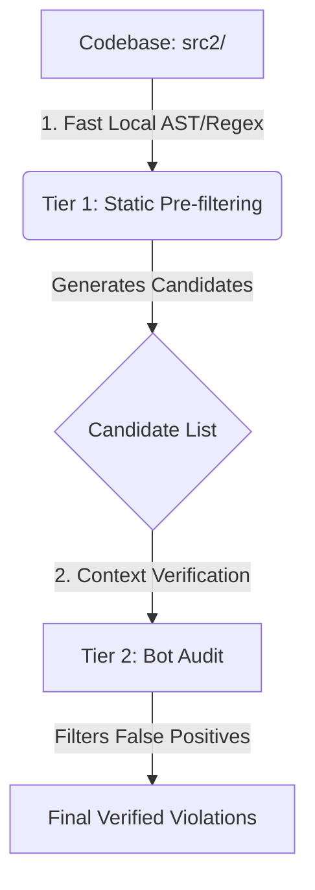

# 🧹 Codebase Hygiene Suite

This directory contains the automated code hygiene suite. It uses a **Hybrid Static Analysis + LLM Auditing** approach to detect, analyze, and report technical debt, logical errors, and styling violations across the target repository's source directory.

---

## 📂 Directory Structure

* 📂 **`scanners/`**: Contains all scanner files in a flat directory.
* 📄 **`scanners/run_all.py`**: Unified master runner script to execute all 11 codebase hygiene scanners in sequence.
* 📄 **`scanners/utils.py`**: Shared utility code containing helper functions for file indexing and checks.
* 📄 **`exceptions.json`**: Global exceptions list containing files exempted from scanning.
* 📂 **`reports/`**: The generated audit outputs. Each scan outputs a machine-readable `.json` data file and a human-readable `.md` report.

---

## 🛠️ The 11 Scanners

All checkers are designed as **Hybrid Bot-Confirmed Scanners** (except `find_message_drift.py`). They run a fast local static extraction script first to filter candidates, then invoke an LLM bot to audit only the candidates and rule out false positives.

### 🤖 Bot-Confirmed Hybrid Scanners (under `scanners/`)
1. 🕵️ **`find_dead_code.py`**: Identifies unused classes/functions across `src2/` using AST import-graph analysis, cross-references them against verified manuals, and audits reachability with a bot.
2. 🛑 **`find_silent_killers.py`**: Identifies swallowed exceptions and silent fallback configurations in code, then validates danger severity with a bot.
3. ⚡ **`find_async_hazards.py`**: Checks async functions for blocking synchronous calls and audits event loop hazards with a bot.
4. 📋 **`find_engine_schemas.py`**: Audits engine calculation inputs/outputs to flag raw dicts/lists, then validates structure with a bot.
5. 🔑 **`find_secrets.py`**: Scans files locally for hardcoded API keys, then validates dummy mocks vs real credentials with a bot.
6. 📈 **`find_env_drift.py`**: Compares `os.getenv` usage against `.env.example`, then validates local fallbacks with a bot.
7. 🔄 **`find_circular_deps.py`**: Maps imports statically to find circular loop entrypoints, then validates functional overrides with a bot.
8. 👥 **`find_duplication.py`**: Scans files for duplicate code blocks, then validates standard boilerplate exceptions with a bot.
9. 🛡️ **`find_type_safety.py`**: Compiles `mypy` type annotation errors, then filters third-party warning false positives with a bot.
10. 💥 **`find_registry_clashes.py`**: Finds dict-style access (`.keys()`, `.values()`, `.get()`, `in` operator) on Pydantic models migrated from dicts in `unified.py`. Uses an LLM to evaluate crash risk and a runtime verifier to confirm actual `hasattr` failures.

### ⚙️ Pure Static Scripts (under `scanners/`)
11. 💬 **`find_message_drift.py`**: Compares Telegram translation keys in the codebase (`text_manager` calls) against `messages.yaml` definitions, and synchronizes code usage comments back to the YAML (no LLM required).

---

## 🔄 The Hybrid 2-Tier Pipeline Flow

To optimize speed, minimize costs, and prevent API token exhaustion, every scanner (except the pure utility `find_message_drift.py`) is structured as a **two-tier audit pipeline**:



### 1. Tier 1: Static Pre-filtering (Fast & Local)
* **What it does**: A local Python static analysis parser (using AST parsing, regular expressions, or graph mapping) scans the entire `src2/` directory to build a list of *potential* violations (candidates).
* **Speed**: Runs in milliseconds, entirely offline, at zero API cost.
* **Recall**: Designed with very high recall (flags *every* potential issue, e.g., identifying 113 untyped functions or raw dictionary parameters).

### 2. Tier 2: LLM Verification (Smart Bot Audit)
* **What it does**: The Pydantic-AI bot is called **only** on the generated candidates list. The bot does *not* read your entire codebase; it only receives the specific code snippets around the flagged candidates.
* **Logic**: The bot performs deep semantic reasoning to determine if the candidate is a true hazard (e.g. `SCHEMA_HAZARD` or `ASYNC_HAZARD`) or if it is a harmless false positive (e.g. internal math utility, test placeholder, standard library default).
* **Efficiency**: Restricting bot calls only to potential problem areas keeps API consumption extremely lightweight and prevents token waste on fully compliant code.

---

## 🚀 How to Run the Scanners

All scanners should be run from the repository root using `uv run`.

```bash
# Run a specific hybrid scanner (invokes static check + LLM confirmation)
uv run kit-hygiene/scanners/find_silent_killers.py

# Run all 11 scanners in sequence
uv run kit-hygiene/scanners/run_all.py
```

---

## 💾 Caching & Cache Management

To preserve execution state and prevent redundant LLM queries, bot-driven scanners (and some static scanners) leverage an incremental JSON cache located in `kit-hygiene/reports/`.

### How Caching Works
1. When running the audit, the scanner loads existing results from the respective JSON file.
2. For each discovered candidate, it checks if it already exists in the cache.
3. If it exists, it skips re-auditing and reuses the previous verdict (updating only the line number if the code shifted).
4. If it is new, it performs the audit (invoking the LLM for bot-driven scanners or executing local static rules for script scanners) and immediately appends the result to the JSON report.

### How to Force a Re-Audit (Invalidating Cache)
When you modify or refactor engine logic, the cache still holds the old verdict. You must invalidate the cache for those files.

To force the scanner to re-audit only the modified files:
1. Open the respective JSON report in [reports/](./reports/).
2. Locate and delete the entries in `audit_results` whose `"file_path"` matches the modified files.
3. Save the JSON file.
4. Rerun the scanner. It will skip all other unchanged files but re-audit the modified ones.

---

## 🚑 Troubleshooting & Resuming Interrupted Scans (Bot Scanners Only)

If a bot-driven scanner execution fails or is aborted (due to network timeout, API limits, or credentials):
1. **Incremental Save Safety**: The script writes back to the JSON file **after every individual LLM response**. You will never lose progress.
2. **Resuming**: Simply run the command again. It will automatically skip already audited functions and pick up exactly where it was interrupted.
3. **Model Selection**: If the LLM throws a model error or API failure, verify the model settings in [control.py](./control.py) and check that your API keys (e.g. `KIT_API_KEY`) are correctly exported in your shell environment.

---

## ⏳ Rate Limiting & Backoff Policy (Bot Scanners Only)

To protect API credentials and prevent rate limit exhaustion (especially under the 15 RPM / free-tier key constraints of LLM-driven scanners):

1. **4-Second Firing Interval**: Every LLM-driven bot scanner pauses for **4 seconds** (`time.sleep(4.0)`) before each request. Spacing out requests at 4 seconds ensures a conservative rate of 15 calls per minute, allowing API token windows to refresh smoothly.
2. **Unified Backoff Retry**: If a call fails or hits a rate limit, the scanner initiates a 3-tier backoff sequence:
   * **First Retry**: Pauses for **90 seconds**
   * **Second Retry**: Pauses for **120 seconds**
   * **Third Retry**: Pauses for **240 seconds**
3. **Clean Shutdown**: If the API remains blocked after all 3 retries, the scanner exits cleanly (`sys.exit(1)`) to avoid redundant failures and key locking.


